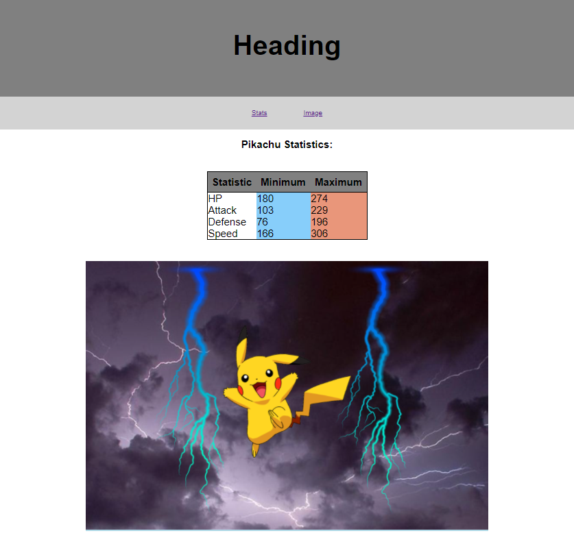

# Task

This task will cover HTML/CSS skills from the lectures/labs in the following areas:
+ HTML tables
+ CSS position properties
+ CSS box model and spacing/positioning elements
+ Using and centering elements
+ Using appropriate elements including 'divs' where required 
+ Creating nav links that link to particular elements within the page

The images are included within an images folder; however, you will be required to create the HTML and CSS files and the content in them.

In this activity you will create the required HTML and CSS to display the content as per the image below.

The requirements of the task are:

+ The heading should be contained within a separate div and have a background similar to the image below.  

+ The nav menu should have links that link to the statistics section and the image. Note that you may only see the difference if you're zoomed in or using a narrow screen.

+ Appropriate CSS should be applied to table elements in order to make it display similar to the image below. This will require researching some CSS properties and selectors you may not have used before. Hint: you will probably want to use the border-collapse property so that there are no gaps between the cells. Look carefully at the table and observe which parts of the cells have black borders. You should research how to make different columns different colours.

+ The images should be grouped into a div and the position of images in relation to the content div should not change when the screen size changes. The Pikachu image and the lightning images should display as per the screen-shot below.  

+ All elements should be centered and spaced similar to the image below. You should apply an understanding of the CSS box model to space elements out appropriately.

+ The final page should look similar to the image below; there are no exact units required for padding and margin sizes so you should just aim for a similar appearance.

